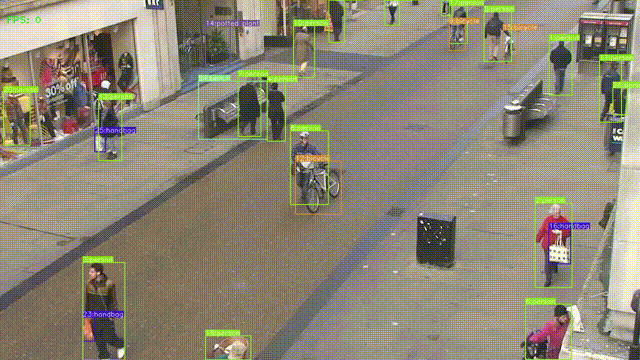

# YOLOv7 Object Tracking

Multiple object tracking with YOLOv7 and SORT. 

This repository is created for the channel [TheCodingBug](https://www.youtube.com/channel/UCcNgapXcZkyW10FIOohZ1uA).
You can find the complete tutorial [Here](https://www.youtube.com/channel/UCcNgapXcZkyW10FIOohZ1uA).

# Object Tracking Results ``YOLOv7`` Weights

# TO DO
* [x] Add flag to enable tracking
* [x] Add flag to hide bbox
* [x] Add flag to hide label
* [x] Add flag to change random seed to assign different color to each class
* [x] Add flag to change size of bbox/label
* [x] Add flag to show fps
* [x] Add flag to draw track
* [x] Track color is the same as the bbox color
* [x] Add flag to enable different color for each track

# Credits  
  * [WongKinYiu Yolov7 Repo](https://github.com/WongKinYiu/yolov7)
  * [RizwanMunawar Yolov7 Object Tracking Repo](https://github.com/RizwanMunawar/yolov7-object-tracking)
  * [abewley SORT Repo](https://github.com/abewley/sort)
  * [TheAIGuy DeepSort Repo](https://github.com/theAIGuysCode/yolov4-deepsort)
